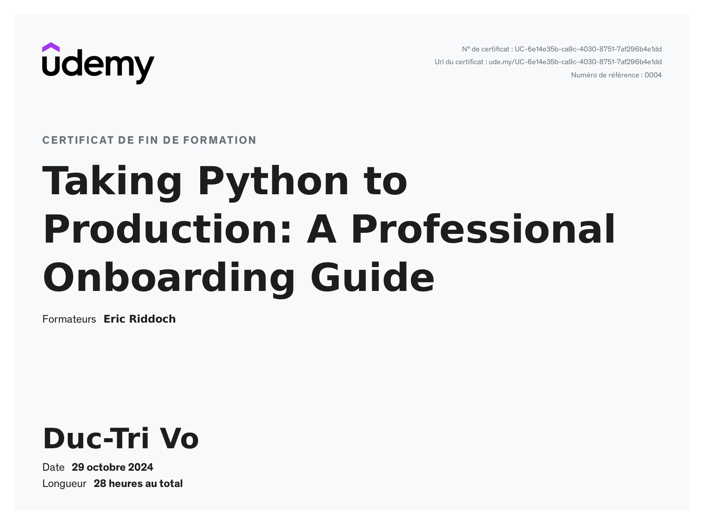

# Taking Python to Production: A Professional Onboarding Guide

Approximately 28 hours!

Verify link: [Udemy.com](https://www.udemy.com/certificate/UC-6e14e35b-ca9c-4030-8751-7af296b4e1dd/)

### Learning objectives:
1. Set up a professional Python development environment using Visual Studio Code, pyenv, Git, and autocompletion  
2. Learn the professional Git workflow with GitHub and implement CI/CD with GitHub Actions  
3. Make the terminal more intuitive by using ZSH and plugins  
4. Version and package Python software and publish it for the community  
5. Set up automated code quality checks, including testing, linting, documentation, and type checking
